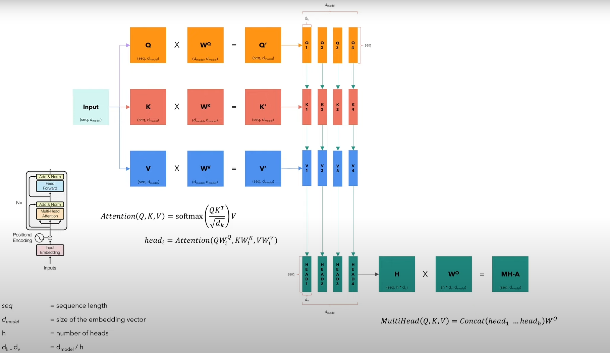

## **Coding a Transformer from Scratch**

1. [Build Transformer from scratch](https://github.com/MonitSharma/Roadmap-to-LLMs/tree/main/01_transformer_from_scratch/transformer_model)

2. [Build GPT from scratch](https://github.com/MonitSharma/Roadmap-to-LLMs/tree/main/01_transformer_from_scratch/building_gpt)


---


Welcome to this hands-on implementation of the **Transformer model** — the foundation of modern large language models (LLMs) like BERT, GPT, and T5.

This guide walks you through building a Transformer **from the ground up**, using **PyTorch**, with clear explanations and modular components. No black boxes — just pure understanding.

By the end, you'll understand:
- How embeddings and positional encoding work
- The role of attention, normalization, and feed-forward layers
- How multi-head attention enables richer representations
- And how all pieces fit together in the full encoder-decoder architecture

> 🔁 This implementation focuses on **educational clarity**, not performance. It’s perfect for learning, experimenting, and extending.

---

### **The Embedding and Positional Encoding Layer**


In a Transformer, input tokens are first converted into dense vectors using an **embedding layer**. But unlike RNNs, Transformers have **no inherent notion of order** — so we must inject information about the **position** of each token.

This is done via **positional encoding**: a set of fixed or learned patterns added to the token embeddings.

We use **sinusoidal positional encodings** (as in the original paper), which allow the model to learn relative positions effectively and generalize to longer sequences.

#### 🔢 Positional Encoding Formulas

$$
\Large{PE_{(pos, 2i)} = \sin\left(\frac{pos}{10000^{2i / d_{model}}}\right)}
$$

$$
\Large{PE_{(pos, 2i+1)} = \cos\left(\frac{pos}{10000^{2i / d_{model}}}\right)}
$$

- `pos` = position in the sequence (0, 1, 2, ...)
- `i` = dimension index
- `d_model` = embedding dimension (e.g., 512)

These sine and cosine functions create unique, periodic patterns for each position, enabling the model to attend to relative positions (e.g., "3 tokens ahead").

💡 **Why this works**: The choice of frequencies allows the model to learn functions like $ f(pos + k) $ as linear transformations of $ f(pos) $, aiding in capturing relative positions.

---

### **Add and Normalize (Add & Norm)**


After each sub-layer (e.g., attention or feed-forward), the Transformer uses **residual connections** followed by **layer normalization**.

This two-step process:
1. **Add**: Adds the input of the sub-layer to its output (residual/skip connection)
2. **Norm**: Applies LayerNorm to stabilize training

$$
\text{Output} = \text{LayerNorm}(x + \text{Sublayer}(x))
$$

✅ Benefits:
- Residual connections ease gradient flow (critical for deep networks)
- LayerNorm stabilizes activations across features

This pattern appears throughout the architecture and is key to training deep models effectively.

---

#### **Layer Normalization**


Unlike BatchNorm, which normalizes across the batch dimension, **LayerNorm** computes mean and variance **over the feature dimension** for each individual sample.

$$
\hat{x}_i = \frac{x_i - \mu}{\sqrt{\sigma^2 + \epsilon}}, \quad
\mu = \frac{1}{H}\sum_{i=1}^H x_i, \quad
\sigma^2 = \frac{1}{H}\sum_{i=1}^H (x_i - \mu)^2
$$

Then scales and shifts with learned parameters $ \gamma $ and $ \beta $:

$$
y_i = \gamma \hat{x}_i + \beta
$$

🧠 LayerNorm ensures stable training even when batch size is small — ideal for Transformers.

---

### **Feed-Forward Network (FFN)**


Each position in the sequence passes through the same **two-layer fully connected network**:

$$
\text{FFN}(x) = \max(0, xW_1 + b_1)W_2 + b_2
$$

Or with ReLU:
$$
\text{FFN}(x) = W_2(\text{ReLU}(W_1x + b_1)) + b_2
$$

🔧 Key details:
- Applied **independently** to each position (no parameter sharing across positions)
- Typically uses a large inner dimension (e.g., $ d_{ff} = 2048 $ when $ d_{model} = 512 $)
- Introduces non-linearity and expressive power after attention

This layer acts as a position-wise "thinking" module, transforming attention outputs into richer representations.

---

### **Base Attention (Scaled Dot-Product Attention)**


The core of the Transformer is **scaled dot-product attention**:

$$
\text{Attention}(Q, K, V) = \text{softmax}\left(\frac{QK^T}{\sqrt{d_k}}\right)V
$$

Where:
- $ Q $: Query vectors (what you're looking for)
- $ K $: Key vectors (what others contain)
- $ V $: Value vectors (information to retrieve)

🔍 The $ \sqrt{d_k} $ scaling prevents large dot products from pushing softmax into regions with small gradients.

🧠 This mechanism allows each token to **attend to all other tokens**, computing a weighted sum of values based on relevance.

Used in:
- Self-attention (Q, K, V from same sequence)
- Encoder-decoder attention (Q from decoder, K/V from encoder)

---

#### **Multi-Head Attention**



Instead of computing attention once, the model **projects queries, keys, and values multiple times** with different learned linear projections, then runs attention in parallel.

$$
\text{MultiHead}(Q, K, V) = \text{Concat}(head_1, ..., head_h)W^O
$$
$$
\text{where } head_i = \text{Attention}(QW_i^Q, KW_i^K, VW_i^V)
$$

🎯 Benefits:
- Allows the model to **focus on different parts of the sequence** in different representation subspaces
- E.g., one head might capture syntax, another long-range dependencies

The outputs are concatenated and projected back to $ d_{model} $, preserving dimensionality.

💡 Think of it like having multiple "experts" vote on what's important.

---

> ✅ **Next Steps**  
> Now that you understand each component, explore the code in:
> - `model.py` – Full Transformer implementation
> - `train.py` – Training loop with TensorBoard logging
> - `dataset.py` – Dataloader and tokenization setup

🚀 Ready to train your first Transformer? Run:
```bash
python train.py
```

💡 **Tips for Extending**

- Try different positional encodings (learned vs. sinusoidal)
- Add dropout for regularization
- Implement beam search for decoding
- Export to ONNX or TorchScript for deployment


## **Resources Used**

1. [Tensorflow Tutorial on Transformer](https://www.tensorflow.org/text/tutorials/transformer)
2. [Coding a Transformer from Scratch - YouTube Video by Umar Jamil](https://www.youtube.com/watch?v=ISNdQcPhsts)
3. [Visualizing transformers and attention by Grant Sanderson](https://www.youtube.com/watch?v=KJtZARuO3JY)
4. [Attention in transformers, step-by-step | Deep Learning Chapter 6](https://www.3blue1brown.com/lessons/attention)
5. [Neural Networks - Course by 3Blue1Brown](https://www.youtube.com/playlist?list=PLZHQObOWTQDNU6R1_67000Dx_ZCJB-3pi)
6. [Attention is all you need](https://arxiv.org/abs/1706.03762)